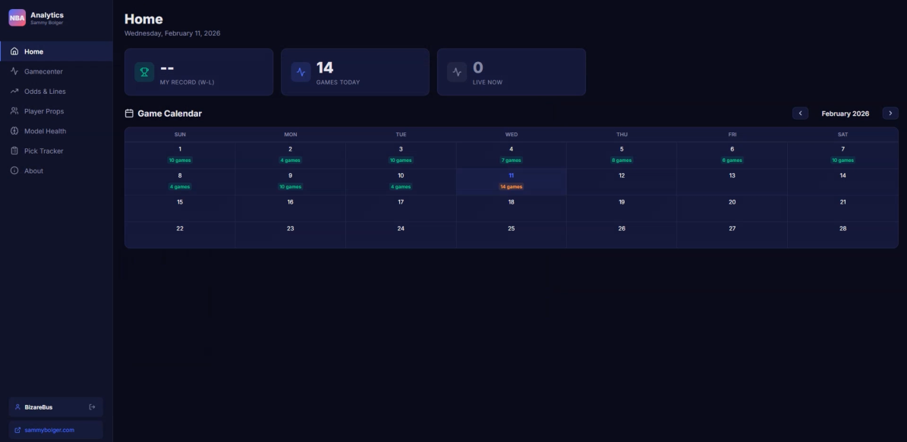

# NBA Betting Analytics Pipeline

A full stack real time NBA analytics dashboard with ML powered moneyline predictions. Sign up, track your picks, view live game data, and see how your record stacks up, all powered by a logistic regression model trained on rolling team statistics.

**For informational and educational purposes only. Not financial advice.**

---

## Screenshots

---

### Home Dashboard


---

### Gamecenter


---

### Odds & Lines


---

### Pick Tracker


---

## Features

- **User accounts** with signup/login and per user pick isolation
- **Home dashboard** with W-L record, today's games, and interactive game calendar
- **Gamecenter** with live, scheduled, and final game cards (auto-refresh every 15s)
- **Odds & Lines** with ML computed moneylines, probability bars, confidence levels, and one click pick buttons
- **Pick Tracker** with active picks view, pick history toggle, and automatic grading
- **Model Health** page with ML metrics and manual retrain button
- **About page** with project explanation, moneyline disclaimer, and responsible gambling notice
- **Dark theme** professional NBA inspired design
- **Future-proof** with auto detected season dates and dynamic year rollover

---

## How It Works

- Game data is pulled from the BallDontLie API every 15 seconds during live games
- Rolling team stats (last 10 games) are computed: win %, points scored/allowed, net rating
- A logistic regression model is trained on historical game outcomes using these features
- Before each game, the model predicts each team's win probability
- Probabilities are converted to American moneyline format for easy reading
- Users can pick one team per game before tipoff and track their record over time
- Picks are automatically graded when games finish

---

## Technologies Used

- **Python** with FastAPI for the backend API
- **React 19** with Vite for the frontend
- **SQLite** with SQLAlchemy ORM for data storage
- **scikit-learn** for ML model training and inference (Logistic Regression)
- **APScheduler** for background task scheduling
- **JWT** with HttpOnly cookies for authentication
- **bcrypt** for password hashing
- **Recharts** for data visualizations
- **Lucide Icons** for UI iconography
- **React Router** for client-side routing

---

## How to Run

Clone the repo:
```bash
git clone https://github.com/SammyBolger/nba-betting-analytics.git
cd nba-betting-analytics
```

Install backend dependencies:
```bash
pip install fastapi uvicorn sqlalchemy apscheduler scikit-learn bcrypt python-jose httpx pydantic
```

Install frontend dependencies:
```bash
cd frontend
npm install
cd ..
```

Create a `.env` file:
```bash
cp .env.example .env
```

Fill in your API key and session secret.

Run the backend:
```bash
python run_backend.py
```

Run the frontend (in a separate terminal):
```bash
cd frontend
npm run dev
```

Open [http://localhost:5000](http://localhost:5000)

---

## Building for Production

Backend:
```bash
python run_backend.py
```

Frontend:
```bash
cd frontend
npm run build
```

Serve the built frontend with any static file server pointing to `frontend/dist`.

---

## Environment Variables

| Variable | Description |
|---|---|
| `BDL_API_KEY` | BallDontLie API key (required for live game data) |
| `SESSION_SECRET` | JWT signing key for authentication cookies |
| `APP_TIMEZONE` | Timezone for day cutoff (default: `America/Chicago`) |
| `REFRESH_SECONDS` | Auto-refresh interval in seconds (default: `15`) |

---

## Automation

| Job | Interval |
|---|---|
| Live game ingestion | Every 15 seconds |
| Box score ingestion | Every 5 minutes |
| Pick grading | Every 10 minutes |
| Calendar backfill | Every 2 minutes |
| Daily model retrain | 6 AM UTC (cron) |

Season start/rollover is auto-detected from the current date. No manual updates needed across seasons.

---

## Key Design Decisions

- 1 AM Central Time day cutoff for all game displays
- One pick per game, changeable before tipoff
- Games sorted chronologically on Odds page
- Graded picks archived in Pick History view
- Moneylines computed from model probabilities, not real sportsbook lines
- Season dates auto-computed (Oct 15 start, dynamic year detection)

---

## Future Work

- **Player props** model for points, rebounds, assists predictions
- **Push notifications** for pick results and game alerts
- **Multi-model support** comparing different ML algorithms
- **Historical backtesting** to evaluate model performance over past seasons
- **Parlays and multi-leg picks** for combining multiple game predictions

---

## Data

All game data is sourced from the [BallDontLie API](https://www.balldontlie.io/). User data and picks are stored locally in a SQLite database with per-user isolation via JWT authentication.

---

## Contact

- **LinkedIn:** [Sam Bolger](https://www.linkedin.com/in/sambolger/)
- **Email:** sbolger@cord.edu
- **Portfolio:** [sammybolger.com](http://www.sammybolger.com/)
